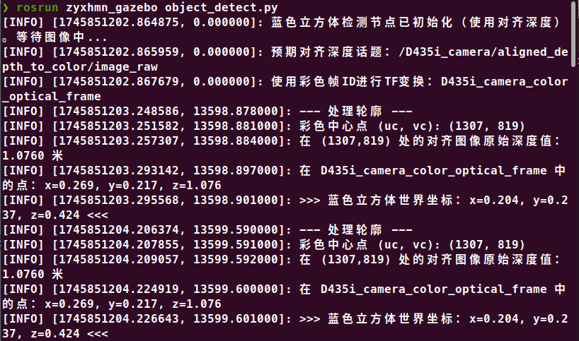

## ROSArmVision

## 环境

系统:ubuntu20

ros:noetic

gazebo:11

## 安装

```bash
mkdir -p catkin_ws/src
cd catkin_ws/src
git clone https://github.com/zyxhmn/ROSArmVision.git
cd ..
catkin_make
```

打开gazebo+rviz+moveit:

```bash
roslaunch panda_moveit_config demo_gazebo.launch world:=<your_path>src/zyxhmn_gazebo/worlds/room.world
```

打开视觉检测节点：

```bash
rosrun zyxhmn_gazebo object_detect.py 
```

打开机械臂拾取控制节点：

```bash
rosrun zyxhmn_gazebo pick_node.py   
```

## 详细说明

### 添加d435i深度相机

在`src/franka/franka_description/robots/panda/panda.urdf.xacro`文件合适位置添加代码：

```bash
</xacro:franka_robot>
  <xacro:include filename="$(find realsense_gazebo_description)/urdf/_d435i.urdf.xacro"/>
  <xacro:sensor_d435i parent="world" name="D435i_camera" topics_ns="D435i_camera">
    <!-- <origin xyz="0.4 0.85 1.5" rpy="0 -1.5708 0"/> -->
    <origin xyz="0 0 1.5" rpy="3.14159 1.5708 0"/>
  </xacro:sensor_d435i>
```

作用为在环境中深度相机。

修改`src/realsense/realsense_gazebo_description/urdf/_d435i.urdf.xacro`以及`src/realsense/realsense_gazebo_description/urdf/_d435i.gazebo.xacro`中的`align_depth:=false`为`align_depth:=true`。

目的是为了使用已配准的深度图像 (Aligned Depth Image)

Intel RealSense ROS 包通常会提供一个已经处理过的深度图像话题，该话题中的每个深度像素值都直接对应于彩色图像相同坐标位置的深度。这省去了我们手动配准的麻烦。

此时使用`rostopic list | grep aligned`输出如下：

```bash
❯ rostopic list | grep aligned
/D435i_camera/aligned_depth_to_color/camera_info
/D435i_camera/aligned_depth_to_color/image_raw
/D435i_camera/aligned_depth_to_color/image_raw/compressed
/D435i_camera/aligned_depth_to_color/image_raw/compressed/parameter_descriptions
/D435i_camera/aligned_depth_to_color/image_raw/compressed/parameter_updates
/D435i_camera/aligned_depth_to_color/image_raw/compressedDepth
/D435i_camera/aligned_depth_to_color/image_raw/compressedDepth/parameter_descriptions
/D435i_camera/aligned_depth_to_color/image_raw/compressedDepth/parameter_updates
/D435i_camera/aligned_depth_to_color/image_raw/theora
/D435i_camera/aligned_depth_to_color/image_raw/theora/parameter_descriptions
/D435i_camera/aligned_depth_to_color/image_raw/theora/parameter_updates
```

### world环境

文件位于`zyxhmn_gazebo/worlds/room.world`,下载自[gazebo模型库](https://app.gazebosim.org/)的[living room](https://app.gazebosim.org/makerspet/worlds/living_room)，并对其进行修改。


### 视觉检测节点

通过opencv识别颜色以及轮廓来检测目标物体，并且发布其相对与world坐标的位置。




### 抓取

具体可见视频

<video width="320" height="240" controls>
  <source src="0.mkv" type="./zyxhmn_gazebo/imgs/0.mkv">
  Your browser does not support the video tag.
</video>
